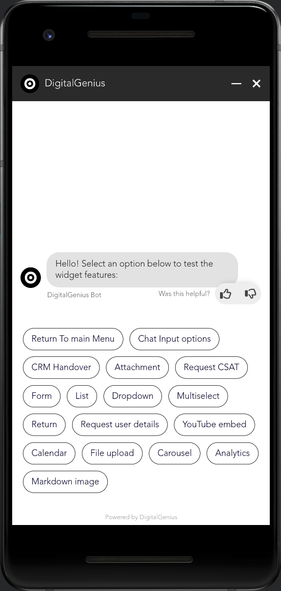
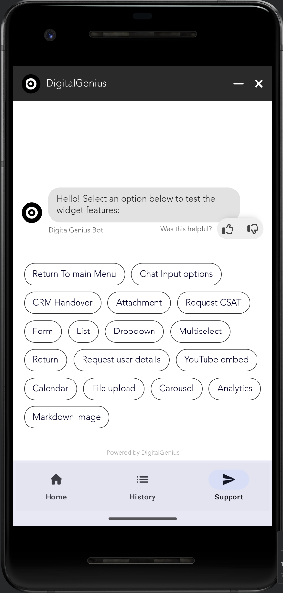

# ``DGChatSDK``

<div align="center">
   
</div>

<!---->

Android SDK for DigitalGenius Chat.

## 🏷 License

`DGChatSDK` is a property of DigitalGenius Ltd.

### Requirements

- Android 5+

## Overview

This SDK enables the DigitalGenius Chat Widget to be embedded anywhere inside an Android app.
The SDK requires minimal setup. Please see the `DemoApp` or `DemoAppCompose` for example.

A DigitalGenius Customer Success Manager will provide you with a custom `widgetId`, `env` and `version` before getting started.
Please see the `Integrating SDK to your project` section for details on how to integrate the following settings into an Android app using the SDK.

## Installation

1. Extract the provided `chatwidgetsdk` zip.
2. Add to your build gradle file:
    ```Groovy
    dependencies {
        implementation fileTree(include: ['*.jar', '*.aar'], dir: 'libs')
    }
    ```
3. Put `DGChatSDK.aar` into your `project/module/libs` folder.
4. Click `Sync Project with Gradle files` in Android Studio

If you experiencing any troubles with SPM installation or updates, please try following [manual](TROUBLESHOOTING.md) before submitting a new bug.

## Basic usage example

```Kotlin
class MainActivity : ComponentActivity() {
    override fun onCreate(savedInstanceState: Bundle?) {
        super.onCreate(savedInstanceState)
        DGChatSdk.init(
            widgetId = "your_widget_id",
            env = "your_env",
            configs = mapOf(
                Pair("generalSettings", mapOf(Pair("isChatLauncherEnabled", true))),
		...
            )
            useCache = true,
            crmPlatform = "your_crm", // optional
            crmVersion = "your_crm_version", // optional
            callbacks = object : IDGChatWidgetListener {
                override fun onChatMinimizeClick() {
                    Toast.makeText(
                        this@MainActivity,
                        "User callback -> onChatMinimizeClick",
                        Toast.LENGTH_LONG
                    ).show()
                }

                override fun onChatEndClick() {
                    Toast.makeText(
                        this@MainActivity,
                        "User callback -> onChatEndClick",
                        Toast.LENGTH_LONG
                    ).show()
                }

                override fun onChatLauncherClick() {
                    Toast.makeText(
                        this@MainActivity,
                        "User callback -> onChatLauncherClick",
                        Toast.LENGTH_LONG
                    ).show()
                }

                override fun onChatProactiveButtonClick() {
                    Toast.makeText(
                        this@MainActivity,
                        "User callback -> onChatProactiveButtonClick",
                        Toast.LENGTH_LONG
                    ).show()
                }

                override fun onCSATPopoverCloseClicked() {
                    Toast.makeText(
                        this@MainActivity,
                        "User callback -> onCSATPopoverCloseClicked",
                        Toast.LENGTH_LONG
                    ).show()
                }

                override fun onChatInitialised() {
                    Toast.makeText(
                        this@MainActivity,
                        "Chat callback -> onChatInitialised",
                        Toast.LENGTH_LONG
                    ).show()
                }
            },
            metadata = """
                metadata: {
                    "currentPage": "some-random-string",
                    "currentPageTitle": "another-random-string"
                }
            """.trimIndent()
        )
        attachDGChatViewToLifecycle()

        /*
            ....
         */

       val methods = showDGChatView()
       methods.minimizeWidget()
       methods.sendMessage("your message")
       methods.launchWidget()
       methods.initProactiveButtons(
          listOf("question1", "question2", "question3"),
          listOf("answer1", "answer2", "answer3")
       )
    }
}
```

And finally, just call ``showDGChatViewWith(animator: DGChatViewAnimator)`` to present a chat button on top of specified Activity with animation or ``showDGChatView()`` if you dont wish to have animation.

Methods ``showDGChatViewWith(animator: DGChatViewAnimator)`` and ``showDGChatView()`` returned ``DGChatMethods`` which can be used to performed programmatically widget actions

> 🧐 Best user experience with DGChatSDK achieved when using maximum possible view size e.g. - full size UIView or Window itself.


## Additional custom configs
You can use config to customise your chat widget style. Eg: floating button position, proactive buttons

```Kotlin
   configs = mapOf(
                Pair(
                    "proactiveButtonsSettings", mapOf(
                        Pair("isEnabled", true),
                        Pair("questions", arrayOf("A", "B", "C")),
                        Pair("answers", arrayOf("1", "2", "3")),
                    )
                ),
                Pair("generalSettings", mapOf(Pair("isChatLauncherEnabled", true))),
                Pair(
                    "widgetPosition",
                    mapOf(
                        Pair(
                            "mobile", mapOf(
                                Pair(
                                    "launcher", mapOf(
                                        Pair("bottom", "10px"),
                                        Pair("right", "10px")
                                    )
                                ),
                                Pair(
                                    "proactive", mapOf(
                                        Pair("bottom", "90px"),
                                        Pair("right", "20px")
                                    )
                                ),
                                Pair(
                                    "dialog", mapOf(
                                        Pair("top", "0px"),
                                        Pair("right", "0px"),
                                        Pair("bottom", "0px"),
                                        Pair("left", "0px"),
                                    )
                                )
                            )
                        )
                    )
                ),
            )

```

## Additional Methods

<!--START OF ANDROID CONVERT NEEDED-->

You can use a set of additional methods to interact directly with Chat Widget. These methods are lised as a part of ``DGChat`` instance.

The `sendMessage` method allows the customer to programmatically send a message on the user behalf. This method is not available once the user is handed over to a crm:

```swift
func sendMessage(_ message: String, completion: @escaping (Result<Void, Error>) -> Void)

func sendMessage(_ message: String) async throws
```

The `launchWidget` method allows the customer to programmatically launch the widget:

```swift
func launchWidget(_ completion: @escaping (Result<Void, Error>) -> Void)

func launchWidget() async throws
```

The `initProactiveButtons` method allows the customer to programmatically trigger the proactive buttons to display:

```swift
func initProactiveButtons(values: String, completion: @escaping (Result<Void, Error>) -> Void)

func initProactiveButtons(values: String) async throws
```

The `minimizeWidget` method allows customer to minimise an expanded chat UI to the "launcher" state programmatically:

```swift
func minimizeWidget(_ completion: @escaping (Result<Void, Error>) -> Void)

func minimizeWidget() async throws
```
<!--END OF ANDROID CONVERT NEEDED-->

See [full methods list](https://docs.digitalgenius.com/docs/methods) for more details.

## Launch chat from an external element
<!--CONVERT TO ANDROID NEEDED-->
If you prefer to launch the chat widget from your UI element (eg: UIButton) rather than using the default SDK launcher, follow these steps:
1. Hide the launcher with this custome config from chat delegate
You can hide the default launcher button by adding the following configuration inside  ``DGChatDelegate.configs``
```
var configs: [String : Any]? {
     ["generalSettings": ["isChatLauncherEnabled": false]]
 }
```

2. Initialize the Chat SDK
Initialize the chat SDK by calling the DGChat.added(to:) function. Then, set the delegate for the SDK by calling DGChat.delegate. To listen for the DGChatAction.onWidgetEmbedded event, implement the DGChatDelegate.didTrack(action:) method. 

4. Manually Launch the Chat Widget
After the SDK is successfully embedded in your application, you can manually launch the chat widget by calling the ``expandWidget(_ completion:)`` function attach to your

Below is a complete example of how to configure the SDK to manually launch the chat widget
```swift
class ChatViewController: UIViewController, DGChatDelegate {
    
    // Lazy var UIButton with title 'Chat with us'
    lazy var chatButton: UIButton = {
        let button = UIButton(type: .system)
        button.setTitle("Chat with us", for: .normal)
        button.translatesAutoresizingMaskIntoConstraints = false
        // Add action to button for touchUpInside event
        button.addTarget(self, action: #selector(chatButtonTapped), for: .touchUpInside)
        return button
    }()
    
    override func viewDidLoad() {
        super.viewDidLoad()
        // Set up Chat
        DGChat.delegate = self
        DGChat.added(to: self) { chatView in
            print("DGChatView is presented now with frame \(chatView.frame)")
        }

        // Add the button to the view hierarchy
        view.addSubview(chatButton)
        chatButton.isEnabled = false
        // Set up button constraints (bottom and trailing)
        NSLayoutConstraint.activate([
            chatButton.trailingAnchor.constraint(equalTo: view.trailingAnchor, constant: -20),
            chatButton.bottomAnchor.constraint(equalTo: view.bottomAnchor, constant: -20),
            chatButton.widthAnchor.constraint(equalToConstant: 150),
            chatButton.heightAnchor.constraint(equalToConstant: 50)
        ])
    }
    
    // Action function for the button
    @objc func chatButtonTapped() {
        DGChat.expandWidget { result in
            // handle result
        }
    }
    

    // MARK: - DGChatDelegate
    func didTrack(action: DGChatSDK.DGChatAction) {
        switch action {
        case .onWidgetEmbedded:
            chatButton.isEnabled = true
        default:
            break
        }
        print("Action track:", action)
    }
    
    func didFailWith(error: Error) {
        // SDK got error
    }
    
    var widgetId: String {
        // Client identifier (Widget Identifier) provided by vendor company.
    }
    
    var env: String {
        // Environment value provided by vendor company.
    }
    
    var configs: [String : Any]? {
        ["generalSettings": ["isChatLauncherEnabled": false]]
    }
}
```
To trigger the chat widget to launch from some external element in your application (i.e. An “Chat with us“ button), call ``launchWidget()`` function inside ``onWidgetEmbedded()`` callback. 
```Kotlin
	var methods: DGChatMethods? = null

	val dgChatView = findViewById<DGChatView>(R.id.straight_dgchatview)
	dgChatView.chatWidgetListener = object : IDGChatWidgetListener{
    	override fun onChatInitialised() {
		}

		override fun onWidgetEmbedded() {
			// Must be run on main thread
			runOnUiThread{
				methods?.launchWidget()
			}
		}
		
		override fun onCSATPopoverCloseClicked() {
		}
		
		override fun onChatEndClick() {
		}
		
		override fun onChatLauncherClick() {
		}
		
		override fun onChatMinimizeClick() {
		}
		
		override fun onChatProactiveButtonClick() {
		}
	}
	methods = dgChatView.show() 

```
<!--CONVERT TO ANDROID NEEDED END-->

# Full screen support
There are two methods to display your chat in full-screen mode:
### 1. Customize Activity Styles via xml config

```xml
    <resources>
       <style name="Theme.MyApplication" parent="android:Theme.Material.Light.NoActionBar">
           <item name="android:windowFullscreen">true</item>
       </style>
    </resources>
```
### 2. Set Full Screen Programmatically

```Kotlin
    window.setFlags(
       WindowManager.LayoutParams.FLAG_LAYOUT_NO_LIMITS,
       WindowManager.LayoutParams.FLAG_LAYOUT_NO_LIMITS
    )
```
   After setting the flags, you can also hide the status bar using the following code:
   
```Kotlin
    WindowCompat.getInsetsController(window, window.decorView).apply {
        hide(WindowInsetsCompat.Type.systemBars())
    }
```

Screenshot:



## Full Screen with Bottom Navigation Tabs
If you wish to implement full-screen mode with bottom navigation tabs, follow these steps:

### 1. Enable drawing over the system bar in your activity

```Kotlin
    enableEdgeToEdge()
```

### 2. Hide the status bar when the Genius Chat tab is displayed

```Kotlin
   WindowCompat.getInsetsController(activity.window, activity.window.decorView).apply {
        if (selectedItem == 2) {
            hide(WindowInsetsCompat.Type.statusBars())
        } else {
            show(WindowInsetsCompat.Type.statusBars())
        }
   }
```

Screenshot:



## Sample project

<!--CONVERT TO ANDROID NEEDED-->
The interaction model and example usage can be found in Demo project. Refer to the `MainActivity.kt` file.

Project UI root is UITabBarController which holds few UIViewControllers. Each one represents a particular way of DGChatSDK usage. 

`ManualCallController.swift` - demonstrates a step-by-step call of DGChatSDK from user-defined UI.

`StraightForwardController.swift` - can be useful example for those cases, when you need to present Chat Widget during view presentation process.

`CustomAnimationController.swift` - provides an example of custom animation added to presentation/dismissal process of Chat Widget. 

`NavigationCallController.swift` - gives an idea on how to keep DGChat widget running across different ViewControllers pushed to the stack.

💭 Please note, that in each call of:

```swift
func added(to: UIViewController, animated: Bool, completion: ((UIView) -> Void)?)
```

is that completion closure produces UIView object which is a reference to an overlay view used by DGChat SDK to represent all needed information. 

> **You can use that reference to show, hide, move, adjust size and perform any other actions available for UIView to adjust DGChat's placement, appearance and etc. according to your needs and your particular project.**

Example on how that UIView can be manipulated can be found in `CustomAnimationController.swift`.  

<!--CONVERT TO ANDROID NEEDED END-->


# React-native

## Installation

1. Extract the provided `chatwidgetsdk` zip.
2. Add to your build gradle file:
    ```Groovy
    dependencies {
        implementation fileTree(include: ['*.jar', '*.aar'], dir: 'libs')
        implementation(platform("org.jetbrains.kotlin:kotlin-bom:1.8.0"))
        implementation("androidx.compose.runtime:runtime:1.4.3")
    }
    ```
3. Put `DGChatSDK.aar` into your `project/android/app/libs` folder.
4. Click `Sync Project with Gradle files` in Android Studio

## Basic usage example
Add to your react-native application class:

```Java
public class MainApplication extends Application implements ReactApplication {
        ...
        @Override
        protected List<ReactPackage> getPackages() {
          @SuppressWarnings("UnnecessaryLocalVariable")
          List<ReactPackage> packages = new PackageList(this).getPackages();
          // Packages that cannot be autolinked yet can be added manually here, for example:
           packages.add(new DGChatSdkPackage());
          return packages;
        }
         ...
```

Add to your react-native activity class:
```Java
    @Override
    protected void onCreate(Bundle savedInstanceState) {
        super.onCreate(savedInstanceState);
        DGChatSdkModule.Companion.initDgChatSdkModule(this);
    }
```

Add to your react-native App.tsx:
```JavaScript
import {useEffect, useState} from 'react';
import {NativeEventEmitter, NativeModules} from 'react-native';
const {DGChatModule} = NativeModules;

...
useEffect(() => {
    const eventEmitter = new NativeEventEmitter(NativeModules.DGChatModule);
    let onChatMinimizeClickEventListener = eventEmitter.addListener('OnChatMinimizeClick', event => {
      DGChatModule.showToast("OnChatMinimizeClick")
    });
    let onChatEndClickEventListener = eventEmitter.addListener('onChatEndClick', event => {
      DGChatModule.showToast("onChatEndClick")
    });
    let onChatLauncherClickEventListener = eventEmitter.addListener('onChatLauncherClick', event => {
      DGChatModule.showToast("onChatLauncherClick")
    });
    let onChatProactiveButtonClickEventListener = eventEmitter.addListener('onChatProactiveButtonClick', event => {
      DGChatModule.showToast("onChatProactiveButtonClick")
    });
    let onCSATPopoverCloseClickedEventListener = eventEmitter.addListener('onCSATPopoverCloseClicked', event => {
      DGChatModule.showToast("onCSATPopoverCloseClicked")
    });


    return () => {
      onChatMinimizeClickEventListener.remove(); 
	  onChatEndClickEventListener.remove(); 
	  onChatLauncherClickEventListener.remove(); 
	  onChatProactiveButtonClickEventListener.remove();
	  onCSATPopoverCloseClickedEventListener.remove();
    };
  }, []
);
...
    DGChatModule.showDGChatView(
       "your_widget_id",
       "your_env",
       true, 
       crmPlatform, // optional
       crmVersion, // optional
       "metadata: { \"currentPage\": \"some-random-string\", \"currentPageTitle\": \"another-random-string\"}"
    );
...

       DGChatModule.sendMessage("your message")
       DGChatModule.launchWidget()
       DGChatModule.initProactiveButtons(
          ["question1", "question2", "question3"],
          ["answer1", "answer2", "answer3"]
       )
...
```

For more detailed example, please refer to `App.tsx`.
